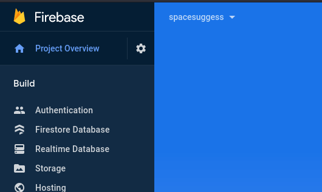

# Criando arquivo `.env`

Para que este projeto funcione nós precisamos configurar o arquivo `.env`. Aqui fiz um tutorial de como criar o arquivo `.env` para este projeto. Espero que ajude.

## Crie o arquivo

A primeira coisa que precisamos fazer é criar o arquivo. No projeto temos um arquivo chamado `.env.example`, nele temos todas as variáveis que precisamos preencher.

Duplique-o e defina seu nome como `.env.local`. Agora temos o arquivo criado.

## Cofiguração do firabse

Precisamos configurar o firebase. Primeiro, crie um novo projeto no [firebase](https://firebase.google.com/?hl=en), nomeie-o da maneira que preferir.

No console do firebase, vá para `Configurações do projeto`. Precisamos adicionar uma aplicação web ao nosso firebase.

</br>



</br>

Agora clique no botão chamado `Adicionar aplicativo` para criar um novo aplicativo. Escolhe a opção de website.

</br>


</br>

Agora adicione um nome e clique no botão `Registrar aplicativo` para criar o seu aplicativo.

</br>


</br>

Algumas informações irão aparecer depois que seu aplicativo for criado. Copie-as e preencha as variáveis de ambiente com as respectivas.

Com seu aplicativo criado, agora precisamos configurar a autenticação.

## Autenticação

No menu, vá para Authentication e selecione Sign-in method. Aqui nós iremos configurar o Github como nosso método de login.

</br>


</br>

Agora seleciona a opção Github e habilite-a. Não posso mostrar aqui, mas irão aparecer três campos. `Client ID`, `Client secret` e um link para você copiar. Estes campos precisam ser preenchidos com as configurações de oAuth do Github.

Vá para suas configuraçẽs do Github e selecione `Developer settings`. Agora vá para a seção `oAuth apps`.
</br>


</br>

Clique no botão `New oAuth app` para criar um novo aplicativo, agora defina um nome e adicione `http://localhost:3000` como sua Homepage URL, o Github deixará apenas esta URL ter acesso. Não se preocupe, você pode mudá-la mais tarde.

Preencha `Authorization callback URL` com a URL mostrada no firebase para você copiar. Agora clique no botão `Register application` para criar.

Copie o `Client ID` e cole no firebase, faça o mesmo com o secret (neste você precisa clicar no botão `Generate a new client secret`. Cuidado, ele só mostra na primeira vez).

Agora, depois de preencher todos os campos do firebase, clique no botão `Salvar`. Pronto, Autenticação está configurada.

## Realtime database

Agora precisamos configurar o banco de dados. Vá para a seção `Realtime database` e crie um novo banco de dados. Use as configurações recomendadas.

Com o seu banco de dados criado, vá para a seção `Rules` e cole essas regras.

```json
{
  "rules": {
    "rooms": {
      ".read": false,
      ".write": "auth != null",
      "$roomId": {
        ".read": true,
        ".write": "auth != null && (!data.exists() || data.child('authorId').val() == auth.id)",
        "suggestions": {
          ".read": true,
          ".write": "auth != null && (!data.exists() || data.parent().child('authorId').val() == auth.id)",
          "likes": {
            ".read": true,
            ".write": "auth != null && (!data.exists() || data.child('authorId').val() == auth.id)",
          }
        }
      }
    }
  }
}
```

Agora a última coisa que devemos fazer é copiar a url do banco de dados. Ela irá aparecer na seção `Data`, e irá se parecer com isso:

```
https://<your_application>.firebaseio.com/
```

Agora cole na variável `NEXT_PUBLIC_DATABASE_URL` no seu arquivo `.env.local`. E pronto. O firebase está configurado!

## BCRYPT

Bcrypt é a biblioteca usada para criar a hash da senha das salas. Para preencher sua variável você pode colocar algum número aleatório, por exemplo 7. É o salto para criar a hash.

<hr />

Agora o projeto está pronto para rodar! Divirta-se!.