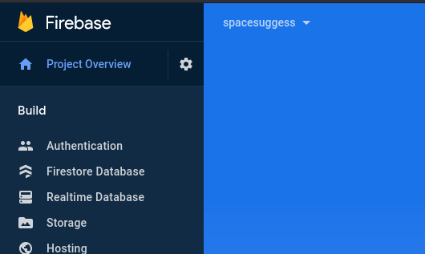
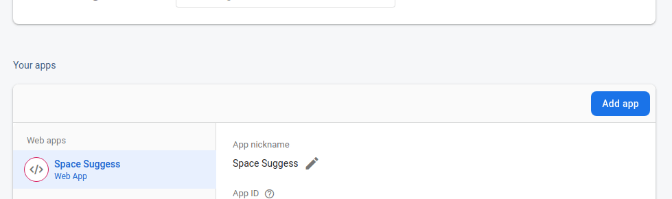
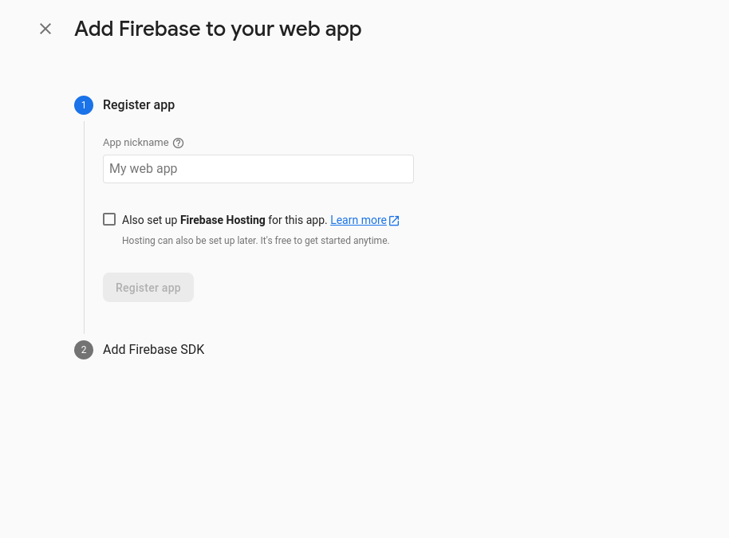
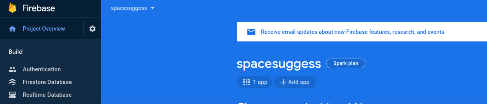
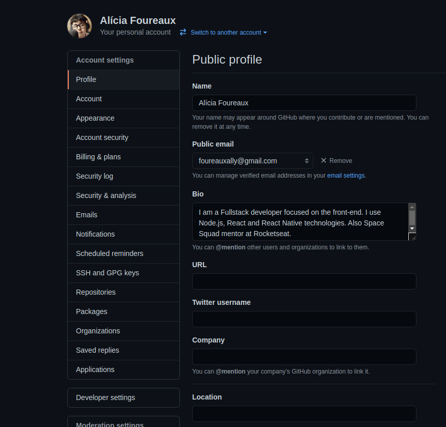

# Creating `.env` file

For this project we need to configure the `.env` file to make it works. Here I made a tutorial on how to create the .env file for this project. Hope it helps.

_[Versão em português](https://github.com/allyfx/space-suggess/tree/master/.github/docs/Create-env-file-pt.md)_

## Create the file

First thing we need to do is create the file. In the project we have a file named `.env.example`, there we have all variables we need to fill.

Duplicate the file and name the new one as `.env.local`. Now we have the file created.

## Firebase settings

We need to configure firebase. First, create a new project in [firebase](https://firebase.google.com/?hl=en), name it as you like.

In the firebase console, go to `Project settings`. We need to add an web app to our firebase.

</br>



</br>

Now click the button called `Add app` to create a new app. Choose the website app option.

</br>



</br>

Now add a name to it and click the `Register app` button to create your app.

</br>



</br>

Some information will appear after your app is created. Copy the informations and fill the environment variables with the respective ones.

With our app created, now we need to configure authentication.

## Authentication

In the menu, go to Authentication and selected Sign-in method. Here we'll configure Github to be our sign-in method.

</br>



</br>

Now select Github option and enable it. I can't show here, but it'll appear three fields. `Client ID`, `Client secret` and a link for you to copy. This fields we need to fill with the github oAuth settings.

Go to your Github settings and selected `Developer settings`. Now go to the `oAuth apps` section.

</br>



</br>

Click the button `New oAuth app` to create a new app, now name it and add `http://localhost:3000` as your Homepage URL, github will only allow this URL to have access. Don't worry, you can change it later.

Fill `Authorization callback URL` with the URL shown in firebase for you to copy. Now click the button `Register application` to create.

Copy the `Client ID` and paste it in firebase, do the same with the secret (in this one you need to click the `Generate a new client secret` button. Carefull, it only appears in the first time).

Now, after fill all firebase fields, click the `Save` button. All done, Authentication is set.

## Realtime database

Now we need to configure the database. Go to `Realtime database` section and create a new database. Use all recommended settings.

With your database created, go to `Rules` section and paste these rules.

```json
{
  "rules": {
    "rooms": {
      ".read": false,
      ".write": "auth != null",
      "$roomId": {
        ".read": true,
        ".write": "auth != null && (!data.exists() || data.child('authorId').val() == auth.id)",
        "suggestions": {
          ".read": true,
          ".write": "auth != null && (!data.exists() || data.parent().child('authorId').val() == auth.id)",
          "likes": {
            ".read": true,
            ".write": "auth != null && (!data.exists() || data.child('authorId').val() == auth.id)",
          }
        }
      }
    }
  }
}
```

Now the last thing we need to do is copy the database url. It appears in `Data` section, and it'll look like this:

```
https://<your_application>.firebaseio.com/
```

Now paste it at `NEXT_PUBLIC_DATABASE_URL` in your `.env.local` file. And we're done. Firebase is setted!

## BCRYPT

Bcrypt is the library used to hash the rooms passwords. To fill it's variable you can put some random number, like 7. It's the salt to create the hash.

<hr />

Now your project is ready to run! Have fun!